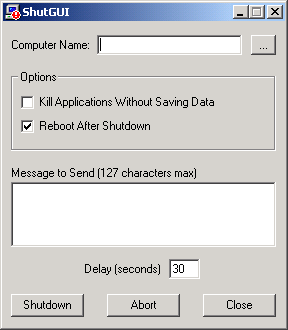



## ShutGUI

### Description

Shows how to shutdown remote computers. Only works on NT or 2000 machines. Also shows how to make command buttons look like C++ buttons.
 
### More Info
 

             |
---                |---
**Submitted On**   |2001-10-28 11:04:40
**By**             |[marcasdasdf](https://github.com/Planet-Source-Code/PSCIndex/blob/master/ByAuthor/marcasdasdf.md)
**Level**          |Intermediate
**User Rating**    |5.0 (15 globes from 3 users)
**Compatibility**  |VB 6\.0
**Category**       |[Complete Applications](https://github.com/Planet-Source-Code/PSCIndex/blob/master/ByCategory/complete-applications__1-27.md)
**World**          |[Visual Basic](https://github.com/Planet-Source-Code/PSCIndex/blob/master/ByWorld/visual-basic.md)
**Archive File**   |[ShutGUI3158510282001\.zip](https://github.com/Planet-Source-Code/marcasdasdf-shutgui__1-28473/archive/master.zip)

### API Declarations

See source code...

